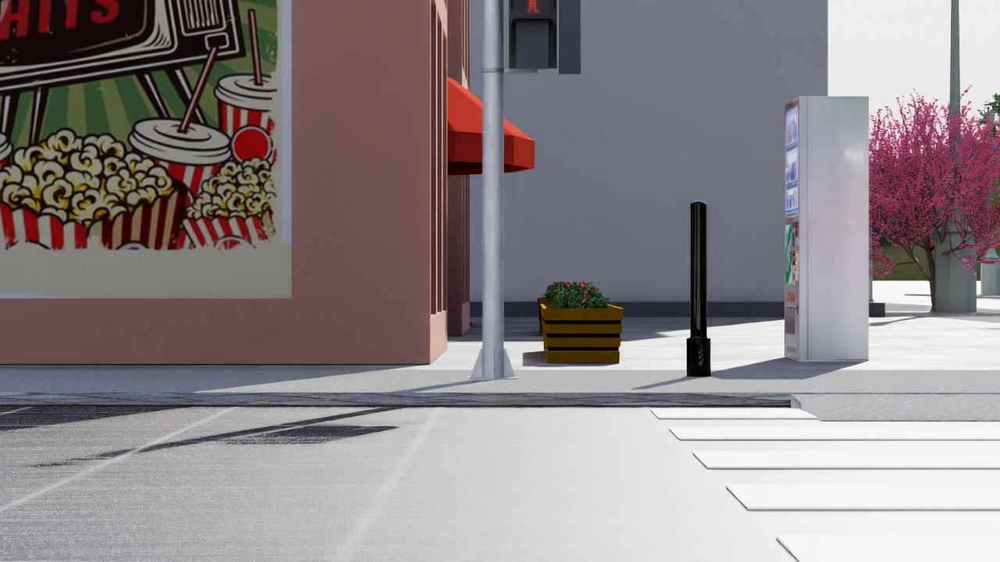
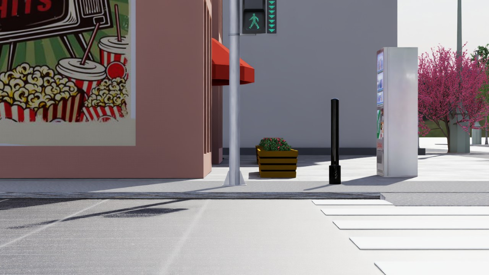

# go2_city_sim

Isaac Sim 5.0 + URBAN-SIM 기반 **VLA 학습 데이터 수집용 도시 시뮬레이션**.
130×130m 루프 코스 도시(신호교차로 4개, 보차혼용길, 프롬나드, 공사구역)에서
COCO 배달로봇(Unitree Go2 기반)을 웹 브라우저로 텔레옵하며, 신호등이 실제
운영 계획(43.8초 사이클, 동시보행 스크램블)대로 점등한다.

| 적색 (차량 통행) | 보행 (동시보행) | 점멸 (1Hz) |
|---|---|---|
|  |  |  |

## 저장소 구조

```
assets/
  city_layout.json      # 도시 좌표 단일 소스(도로·횡단보도·신호등·건물·course·routes)
  usd/ped_light_asa21/  # 보행등 실사 모델 (Sketchfab CC-BY, Objaverse 경유)
  usd/objects/          # 사용 중인 건물 13종 + 가구 5종 (URBAN-SIM GLB → USD 변환본)
  src/                  # 원본 GLB
scripts/
  build_city.py         # city_layout.json → city_static.usd + 검증 스크린샷
  convert_assets.py     # GLB → USD 일괄 변환 (omni.kit.asset_converter)
  gen_signal_plan.py    # 신호 운영 계획 웹문서(docs/city_plan.html) 생성
  test_heads.py         # 보행등 격리 캘리브레이션 씬 (TH_RULER=1로 눈금 렌더)
  test_people.py        # 보행자 애니메이션 배선 검증 씬 (걷기 사이클 6컷)
  dump_bboxes.py, s3_pull.py   # 유틸: bbox 실측 / NVIDIA SimReady 에셋 다운로드
teleop/
  teleop_append.py      # 웹 텔레옵 + 신호 상태머신 (play.py 프렐류드 뒤에 이어붙임)
  go2_web.yaml          # 환경 설정 (unitree_go2, num_envs 1)
  traffic.py            # 동적 트래픽 — 차량(기구학) + 보행자(AnimationGraph 구동)
  run_go2.sh            # 재조립 + 설정 설치 + 기동 (자동 리스폰 6회)
setup/                  # 컨테이너/URBAN-SIM 설치 스크립트
docs/
  city_plan.html        # 신호 운영 계획 v1.4 (애니메이션 도면)
  shots/                # 검증 스크린샷
```

## 외부 의존성 (저장소 미포함)

외부 에셋은 **`python3 setup/fetch_assets.py`** 한 번으로 수급·정리·검증된다
(없는 것만 내려받음, `--check`는 검증만). 세부:

| 의존성 | 크기 | 출처 (fetch_assets.py가 자동 처리) |
|---|---|---|
| NVIDIA 에셋(`assets_nvidia/`) — 나무·관목·신호등·소품·HDR | 1.8GB | NVIDIA Omniverse 공개 S3 |
| NVIDIA People(`assets/usd/people/`) — 보행자 캐릭터 10종·걷기 클립 24종·AnimationGraph | 0.7GB | NVIDIA Omniverse 공개 S3 |
| URBAN-SIM 에셋 팩 — objects GLB·vMaterials·COCO 로봇·보행자 | 8.6GB | HuggingFace `Hollis71025/URBAN-SIM-Assets` |
| asa21 보행등 GLB | 0.7MB | Objaverse (저장소에도 동봉) |
| Isaac Sim 5.0 컨테이너 + URBAN-SIM 코드 체크아웃 | — | 별도: NGC 이미지, URBAN-SIM 저장소 → `setup/install_urbansim.sh` |

워크스페이스(호스트 `~/urban_sim` = 컨테이너 `/workspace/urban-sim`)에 위
의존성이 있고, 이 저장소를 워크스페이스 아래에 클론했다고 가정한다.
다른 경로는 환경변수로 조정: `URBANSIM_WS`(컨테이너 쪽), `URBANSIM_WS_HOST`,
`GO2CITY_ROOT`, `CITY_USD`.

## 설치 (처음부터)

전제: NVIDIA GPU + 드라이버, docker + nvidia-container-toolkit.

```bash
# 0) 워크스페이스 = URBAN-SIM 코드 체크아웃 (이 저장소를 그 안에 클론)
git clone https://github.com/metadriverse/urban-sim ~/urban_sim
cd ~/urban_sim && git clone https://github.com/beefed-up-geek/go2_city_sim.git

# 1) 외부 에셋 자동 수급·정리·검증
#    NVIDIA S3 1.8GB + NVIDIA People(보행자) 0.7GB + URBAN-SIM 팩 8.6GB + asa21
python3 go2_city_sim/setup/fetch_assets.py          # --check = 검증만

# 2) Isaac Sim 5.0 컨테이너 생성 (워크스페이스를 /workspace/urban-sim으로 마운트)
docker run -d --name urbansim --gpus all --network host   --memory 20g --memory-swap 28g -e ACCEPT_EULA=Y   -v ~/urban_sim:/workspace/urban-sim nvcr.io/nvidia/isaac-sim:5.0.0   bash -c "sleep infinity"

# 3) 컨테이너 안에 파이썬 환경 구성 (requirements.txt 포함 — 10~20분)
docker exec urbansim bash -c   'cd /workspace/urban-sim && bash go2_city_sim/setup/install_urbansim.sh'
```

보행자는 NVIDIA People 캐릭터 10종 + `Biped_Setup.usd`(AnimationGraph)를 쓰며
1)단계에서 함께 받는다. 배선이 맞는지만 따로 보려면:

```bash
docker exec urbansim bash -c   'cd /workspace/urban-sim && /isaac-sim/python.sh go2_city_sim/scripts/test_people.py'
# → shots/people_f*.jpg 에 걷는 캐릭터 6컷
```

- 파이썬 의존성: 루트 [`requirements.txt`](requirements.txt)
  (전체 고정 버전은 [`setup/requirements.lock.txt`](setup/requirements.lock.txt))
- 에셋 출처·라이선스: [`assets/ATTRIBUTION.md`](assets/ATTRIBUTION.md)

## 실행

```bash
# 1) 도시 빌드 (컨테이너 안, 워밍 상태 1~2분)
docker exec urbansim bash -c \
  'cd /workspace/urban-sim && /isaac-sim/python.sh go2_city_sim/scripts/build_city.py'

# 2) 텔레옵 기동 (호스트, 서버 상주)
setsid nohup bash go2_city_sim/teleop/run_go2.sh > /dev/null 2>&1 &

# 3) 브라우저에서 http://<서버>:8003

# 동적 트래픽 실행 인자
bash go2_city_sim/teleop/run_go2.sh --no-cars           # 보행자만
bash go2_city_sim/teleop/run_go2.sh --no-peds           # 차량만
bash go2_city_sim/teleop/run_go2.sh --no-traffic        # 정적 도시
bash go2_city_sim/teleop/run_go2.sh --cars 6 --peds 20  # 개체 수 지정
bash go2_city_sim/teleop/run_go2.sh --traffic-speed 0.5 # 전체 속도 배율
```

### 웹 엔드포인트

| 엔드포인트 | 설명 |
|---|---|
| `/` | 에고/3인칭 MJPEG + 미니맵 + 체크포인트 UI (방향키 조작) |
| `/status` | 위치·명령·sim fps·**현재 신호 페이즈** JSON |
| `POST /cmd` | `(vx, vy, wz)` 속도 명령 |
| `POST /goto` | `{x,y,z,yaw}` 텔레포트 |
| `POST /sigcfg` | `{"blink": 초}` 보행 점멸 시간 변경 (기본 9.17 = 11m ÷ 1.2m/s) |
| `POST /traffic` | `{"cars": false, "peds": true}` 트래픽 실시간 on/off |
| `POST /cam` | 3인칭 카메라 라이브 튜닝 |
| `/layout` | city_layout.json 서빙 (미니맵용) |
| `/frame/ego`, `/frame/tpv` | 단일 프레임 캡처 |

## 동적 트래픽

차량 11대 + 보행자 17명이 닫힌 루프를 돌며 신호를 지킨다.

- **차량**: 물리 충돌체 없는 기구학 이동. 차로 오프셋·선행차 추종·정지선 감속·로봇 회피.
- **보행자**: NVIDIA People 캐릭터에 `Biped_Setup.usd`의 AnimationGraph를 `AnimationGraphAPI`로
  연결한다. Walk 상태는 `Blend(idle, MotionMatching, weight=Walk)`이고 **MotionMatching 노드가
  변수 `PathPoints`를 받아 걷기 클립 12종을 골라 섞으며 캐릭터를 직접 이동시킨다.**
  따라서 위치를 매 프레임 써넣으면 안 되고, 경로를 주고 위치는 `get_world_transform`으로 읽는다.
  신호·로봇·앞사람 때문에 멈출 때는 `Action="None"`으로 제자리 대기시킨다.
- 필요한 확장(`omni.anim.graph.bundle` 등)은 **Kit 기동 인자**로 켜야 한다
  (기동 후 `enable_extension`으로 켜면 OGN 노드 등록이 실패하고 그래프 실행에서 죽는다).
  `run_go2.sh`가 `--kit_args`로 전달한다.

## 신호 시스템

전 교차로 동기, 사이클 = 38 + blink 초:

```
남북 녹10 → 황3 → 전적1 → 동서 녹10 → 황3 → 전적1
→ 동시보행(스크램블) 녹8 → 점멸 blink(기본 5.83) → 전적2
```

- 차량등 16기: 한국형 신호등(NVIDIA dsready)의 전구 프림 visibility 토글
- 보행등 28기(횡단보도 양끝 2기씩): **asa21 실사 모델 + 검은 커버 오버레이** —
  모델의 LED 표시(적사람/녹사람/카운트다운)가 항상 켜진 텍스처라서,
  상태별로 *비활성 표시만* 검은 커버로 가린다. 상태 그룹(red/grn/cnt/off)의
  visibility만 토글하면 되므로 런타임 로직이 단순하다.
- 점멸은 1Hz (0.5s 토글은 DLSS 시간적 잔상에 묻혀 항상 켜져 보임)
- 좌회전은 비보호(전용 화살표 없음) — 운영 계획은 `docs/city_plan.html` 참고

## 에셋 출처

모든 에셋의 출처·원본 링크·라이선스는 **[assets/ATTRIBUTION.md](assets/ATTRIBUTION.md)** 참조.
요약: 보행등 = "Pedestrian Traffic Light" by ASA21 (Sketchfab, CC BY 4.0) · 건물/가구/로봇 = URBAN-SIM (Apache-2.0) ·
신호등/나무/소품 = NVIDIA Omniverse 콘텐츠(미포함, `s3_pull.py`) · 재질 = NVIDIA vMaterials
